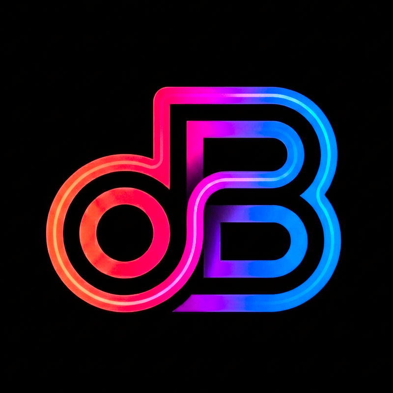

<div align="center">



# dBrief

**Your meetings, remembered.**

A macOS menu bar app that quietly records your meetings, transcribes them on-device, and hands you the brief — summary, action items, who said what — before you've left the room.

[Download for macOS](https://github.com/Arc86/dBrief/releases) · [Roadmap](https://github.com/Arc86/dBrief/issues) · [Report a bug](https://github.com/Arc86/dBrief/issues/new)

</div>

---

## What it does

You press **⌃ ⌥ ⌘ R**. dBrief catches both sides of the call — your mic, their audio — and starts writing things down. When the call ends, AI turns it into the brief you actually need:

- **Summary** of what was decided
- **Action items** with who owns what
- **Tags & sentiment** so you can find it later
- **Clean Markdown note** dropped into Obsidian, Apple Notes, Apple Reminders — wherever you keep your thinking

No bots in your calls. No "I'll review the recording later." No upload to a stranger's cloud.

---

## Why dBrief

Most meeting recorders send your conversations to someone else's GPU. dBrief doesn't have to.

- **Local-first by default** — Apple Silicon? Apple Intelligence and local Gemma 4 mean nothing leaves your Mac
- **Your meetings, your machine** — no dBrief cloud, no account, no telemetry
- **Bring your own model** — want a remote endpoint? Plug in your key, we never see it
- **Calendar-aware** — reads your iCal event, so the title, attendees, and time are filled in automatically
- **Four destinations** — Obsidian, Apple Notes, Apple Reminders, Webhook

---

## Features

### Capture
- **Menu bar native** — no dock icon, no clutter
- **Floating mini-player** — translucent overlay with waveform and controls
- **Global hotkey** — `⌃ ⌥ ⌘ R` from anywhere on your Mac
- **Mic + system audio** — both sides of the call, captured via ScreenCaptureKit
- **Call detection** — auto-starts when Zoom, Teams, Meet, Slack, Webex or FaceTime fires up

### Transcribe
Four engines to choose from — privacy and quality your call:

| Engine | Privacy | Best for |
| --- | --- | --- |
| **Apple Speech** | Fully on-device | Fast, low resource use |
| **Local Whisper** | Fully on-device | Highest accuracy, 15+ languages |
| **Parakeet TDT** | Fully on-device | Long sessions, no segmentation |
| **Remote Endpoint** | Network | BYO Whisper-compatible server |

Plus word-level timestamps, speaker labels, custom vocabulary, and YouTube URL transcription (paste a link, get the transcript).

### Analyze
Four AI backends — local-first, remote optional:

| Engine | Privacy | Requirements |
| --- | --- | --- |
| **Apple Intelligence** | Fully on-device | macOS 26+, Apple Silicon |
| **Gemma 4 E4B Local (MLX)** | Fully on-device | Apple Silicon, ~4 GB model |
| **Local CLI** | Depends on the tool | Any CLI you configure (`claude`, `ollama`, `llm`…) |
| **Remote Endpoint** | Network | OpenAI-compatible server |

Outputs: summary, action items, tags, sentiment, smart title, speaker-attributed transcript.

### Export
Drop a clean Markdown note — with YAML frontmatter — into wherever you already think:

- **Obsidian** (local vault folder)
- **Apple Notes** (AppleScript automation)
- **Apple Reminders** (one reminder per action item, via EventKit)
- **Webhook** (HTTP POST, optional multipart audio upload)

### Workflow
- **Meeting profiles** — save different configurations for team meetings, sales calls, custom workflows
- **Smart file naming** — `YYYY-MM-DD_HHMM_[meeting-title].m4a`
- **Auto-segmentation** — recordings over 30 minutes split into chunks for better accuracy
- **Rich transcript viewer** — word-level timing, audio sync, speaker rename
- **Transcript chat** — ask follow-up questions about a recording using your configured AI
- **YouTube / video URL** — transcribe any `yt-dlp`-supported URL without recording

---

## Requirements

- **macOS 14+** (Sonoma or later)
- **Apple Silicon recommended** — required for Apple Intelligence and local Gemma 4
- **~4–8 GB free disk** for local models (downloaded on first use)
- **`yt-dlp`** (optional, `brew install yt-dlp`) for YouTube transcription

---

## Quick start

### Build from source

```bash
git clone https://github.com/Arc86/dBrief.git
cd dBrief
make run
```

This builds the app bundle in release mode and launches it. First launch walks you through the onboarding wizard — granting permissions and picking your transcription engine.

### Or download a release

Grab the latest `.dmg` from the [Releases](https://github.com/Arc86/dBrief/releases) page and drag dBrief into Applications.

### First recording

1. Click the dBrief icon in your menu bar
2. Press **⌃ ⌥ ⌘ R** (or click **Record**)
3. A floating mini-player appears with the waveform
4. Hit **Stop** when the meeting ends
5. Pick which steps to run (transcribe, summarize, extract actions)
6. Your brief lands in Obsidian — done

> The hotkey is `⌃ ⌥ ⌘ R` — chosen specifically to avoid colliding with Chrome's hard-refresh, Slack's mark-as-read, and other common system shortcuts.

---

## Permissions

dBrief asks for the minimum it needs. You can manage any of these in **Settings → General** at any time.

| Permission | Why | Required? |
| --- | --- | --- |
| Microphone | Recording your voice | Yes |
| Screen Recording | Capturing system audio (both sides of the call) | Recommended |
| Speech Recognition | Apple Speech transcription | Only if using Apple Speech |
| Notifications | Completion alerts | Optional |
| Reminders | Apple Reminders integration | Only if using Reminders |

---

## Architecture

dBrief is built as a **Swift Package Manager executable** (not an Xcode project), targeting macOS 14+ on Swift 6.2. It's `@MainActor`-isolated UI with actor-isolated services for the heavy lifting.

```
Sources/dBrief/
├── App/            # @main, AppContext, AppState, AppSettings
├── Audio/          # ScreenCaptureKit, AVAudioEngine, mixing, M4A/AAC master
├── Models/         # Endpoint, Recording, MeetingProfile, Integrations
├── Services/       # Recording, transcription, AI, integrations
├── UI/             # SwiftUI views (menu bar, settings, overlays)
├── Utilities/      # Keychain, multipart, Markdown formatting
└── Resources/      # Info.plist, icons, Metal shaders
```

Key dependencies (all via SPM):

- [WhisperKit](https://github.com/argmaxinc/WhisperKit) — on-device Whisper (and SpeakerKit diarization)
- [FluidAudio](https://github.com/argmaxinc/FluidAudio) — on-device Parakeet TDT
- [mlx-swift-lm](https://github.com/ml-explore/mlx-swift-lm) — local Gemma 4 via MLX
- [swift-transformers](https://github.com/huggingface/swift-transformers) — tokenizer support for MLX

Tests use [`swift-testing`](https://github.com/apple/swift-testing). Run with `swift test`.

---

## Pair with an AI agent

dBrief doesn't have to do the AI part. If you already use a cloud agent that watches a folder — Notion AI, an OpenAI Assistant, a Google Cloud Document AI pipeline, a Zapier-with-OpenAI hook, anything similar — you can skip dBrief's AI step entirely and let the agent handle it.

The pattern is simple:

1. **Set the export folder** to one your agent watches (an Obsidian vault synced to Notion, a Cloud Storage bucket, a Dropbox folder, an iCloud Drive folder, whatever).
2. **Disable dBrief's AI processing** in Settings → AI & Models (or per-profile).
3. **Record a meeting** as usual. dBrief drops a clean Markdown file in the folder.
4. **The agent picks it up** — summarizes, extracts action items, files it, notifies you.

You're delegating the thinking to a service you already trust, with no API integration to wire up and no extra accounts. dBrief becomes a "just the recording and the transcript" tool; the rest is plumbing the agent handles natively.

### Concrete examples

- **Obsidian → Notion AI** — Sync an Obsidian vault to Notion via the official Obsidian Notion plugin. Notion AI sees the new note and can auto-summarize, tag, or file it in a database.
- **iCloud Drive → Apple Shortcuts + OpenAI** — A Shortcut watches the folder, sends the file to OpenAI, and writes the summary back as a sibling note.
- **Cloud Storage → Cloud Functions** — A Google Cloud Function triggered on file upload sends the transcript to Vertex AI / Gemini and saves the result in a Firestore doc or a Sheets row.
- **Webhook destination** — dBrief's built-in webhook integration can hit any HTTP endpoint, so you can post straight into an n8n, Make, or Pipedream flow.

The Markdown output is predictable and well-structured: YAML frontmatter, a timestamped transcript with speaker labels, and clean sections. Anything that reads files can use it.

---

## Contributing

Issues, PRs, and feature ideas are all welcome. The codebase has a `CLAUDE.md` with a full architecture overview if you're diving deep.

For new ideas, open an issue first so we can discuss the approach before you spend time on a PR.

---

## License

MIT — see [LICENSE](LICENSE).

---

<div align="center">

Made for people who forget what was decided on Tuesday.

**[Star this repo](https://github.com/Arc86/dBrief)** if dBrief saves your brain once.

</div>
