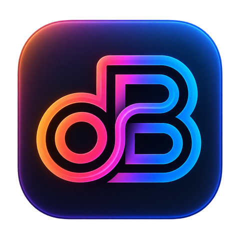

<div align="center">



# dBrief

**Record the meeting. Leave with the notes.**

dBrief is a Mac menu bar app for the part of a meeting that comes after the meeting. It records both sides of a call, gives you a transcript you can search, and can turn that conversation into a short summary and action items. No meeting bot joins the call.

[Download dBrief](https://github.com/Arc86/dBrief/releases) · [Read the docs](https://get.dbrief.nl/docs.html) · [Report a bug](https://github.com/Arc86/dBrief/issues/new)

</div>

## How it works

1. Start recording from the menu bar or press **⌃ ⌥ ⌘ R**. dBrief captures your microphone and, with Screen Recording permission, the other side of the call.
2. Stop when the meeting ends. dBrief saves the audio and makes a transcript. If you enable AI analysis, it also writes a summary and pulls out action items.
3. Review the result in dBrief. Correct a speaker's name, replay a moment, or send the notes where you work.

## Top features

- **Capture both sides of a call** from your Mac, without inviting a meeting bot.
- **Search and replay the transcript** with speaker labels and audio linked to what was said.
- **Get a short brief** with a summary and action items when you turn on AI analysis.
- **Keep meetings organized** with calendar matching, call detection, and profiles for different kinds of calls.
- **Send the result onward** to Obsidian, Apple Notes, Apple Reminders, or a webhook.

You can correct speaker names, ask follow-up questions about a transcript, or listen to a spoken summary. An optional speaker library can recognize familiar voices across recordings. You can also start the next recording while the previous one is still processing.

You can use dBrief just for recording and transcription. AI analysis, speaker recognition, and exports are choices you make in settings.

## Your recordings, your choice of processing

Recordings are stored on your Mac. For transcription, you can use Apple Speech, local Whisper, or Parakeet. For summaries and action items, you can use Apple Intelligence or a local Gemma model. With local processing selected, the meeting content stays on your Mac.

Remote transcription and AI endpoints are available if you prefer them. dBrief can also run a CLI tool you configure; whether that tool sends data elsewhere depends on the tool and your setup. There is no dBrief account or dBrief cloud service.

## Get started

dBrief runs on **Apple Silicon Macs with macOS 14 or later**. Apple Intelligence requires macOS 26 or later. Local models download when you first use them, so allow several gigabytes of free space if you choose local processing.

1. Download the latest `.dmg` from [Releases](https://github.com/Arc86/dBrief/releases) and drag dBrief into Applications.
2. Open dBrief from Applications. It lives in the menu bar and walks you through permissions and your transcription choice.
3. Give it Microphone access. Give it Screen Recording access if you want to capture the other side of a call.

Prefer Homebrew? Run `brew install Arc86/dbrief/dbrief`, then link the app into Applications with `ln -sf "$(brew --prefix)/opt/dbrief/dBrief.app" /Applications/dBrief.app`.

To build from source:

```bash
git clone https://github.com/Arc86/dBrief.git
cd dBrief
make run
```

For the full list of settings and integrations, see the [documentation](https://get.dbrief.nl/docs.html). Bugs and feature requests belong in [GitHub Issues](https://github.com/Arc86/dBrief/issues).
